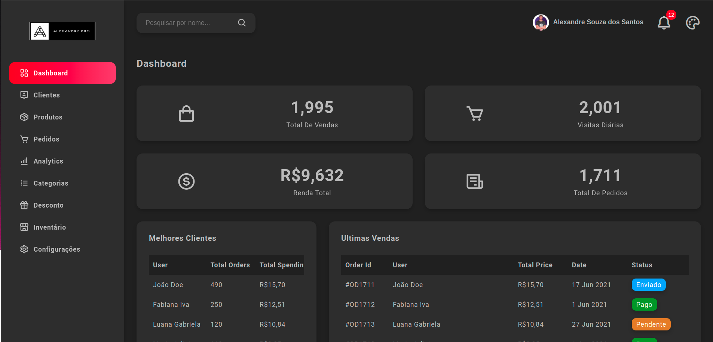

# template for panel of administrator

## Requisitos
- Node.js 
- React
- IDE

## Licença
Distribuido sob a licença MIT License. Veja `LICENSE` para mais informações.

## Após clonar o projeto execute
Instalar as dependências:
>npm install

Abrir o programa:
>npm start
